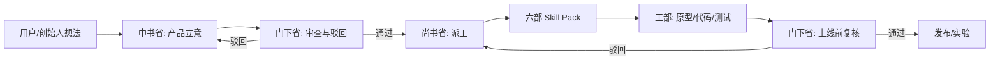

# Agent Skill 架构

## 选择结论

当前项目采用“GStack-first + 三省六部业务治理 + Skill Pack”的 Agent 架构。

原因：GStack 适合作为创业软件工厂底座，负责通用 AI 协作工作流，例如 CEO review、工程评审、设计评审、QA、发布和复盘。三省六部制适合作为等我有钱了的业务治理隐喻，把“创意、审查、执行”拆开，避免一个 Agent 既兴奋地设计爽点，又忽略风险和落地成本。

GStack 是面向 Claude Code 的工具集；在 Codex 中执行时，优先吸收它的组织方式和角色分工，项目内仍用 `AGENTS.md` 和文档约束协作。

等产品进入可运行原型后，再按需要引入具体 Agent 运行框架：

- 需要长流程、状态机、人工审核和可恢复任务时，优先评估 LangGraph。
- 需要快速定义多个角色协作和 YAML 化任务时，优先评估 CrewAI。
- 需要多租户、权限、沙箱、可观测 Agent 服务时，优先评估 AgentScope。
- 需要研究型多 Agent 对话和实验时，再评估 AutoGen。

现阶段不急着绑定 LangGraph、CrewAI、AgentScope 或 AutoGen 这类运行时框架，先用 GStack 的软件工厂流程和本项目的 Skill Pack 把产品方向跑通。

## 三省

| 机构 | 项目职责 | 关键问题 | 主要产物 |
| --- | --- | --- | --- |
| 中书省 | 产品战略与创意立项 | 这个功能解决什么情绪？用户为什么会玩？ | Vision、PRD、路线图、实验假设 |
| 门下省 | 审查与反驳 | 是否诱导真实消费？是否伤害用户？是否跑偏？ | 风险清单、体验审查、合规边界 |
| 尚书省 | 执行与验收 | 怎么拆任务、做原型、上线、验证？ | 任务拆解、代码、测试、发布计划 |

## 六部

| 部门 | Agent/Skill 名称 | 负责内容 | 典型触发语 |
| --- | --- | --- | --- |
| 吏部 | `agent-ops` | Agent 角色、技能边界、任务路由、协作流程 | “给这个项目加一个新 Agent/Skill” |
| 户部 | `wealth-economy` | 虚拟财富系统、消费数值、商业化、指标 | “设计身价、黑卡额度、消费经济系统” |
| 礼部 | `luxury-experience` | 奢华场景、文案、仪式感、分享卡、品牌调性 | “做一个花钱很爽的豪车/酒店场景” |
| 兵部 | `growth-lab` | 增长实验、传播机制、竞品、市场切入 | “设计一个能分享裂变的玩法” |
| 刑部 | `risk-review` | 金融误导、隐私、未成年人、成瘾、内容边界 | “审查这个功能有没有风险” |
| 工部 | `app-delivery` | 客户端、服务端、数据、测试、发布 | “把这个 MVP 功能做出来” |

## 推荐 Skill Pack

### `hm-product-strategy`

用于把想法转成 PRD、用户故事、MVP 范围和路线图。它必须先回答“用户的情绪目标是什么”，再回答“功能是什么”。

### `hm-emotional-economy`

用于设计虚拟财富、额度、消费、资产、身份、状态增长和富人烦恼。它不处理真实金融建议，只处理娱乐化虚拟经济。

### `hm-luxury-scenario`

用于设计豪车、豪宅、酒店、餐厅、旅行、私人服务等高端消费场景。重点是可信细节、戏剧化反馈和分享表达。

### `hm-risk-review`

用于审查金融误导、真实消费诱导、隐私、未成年人、比较焦虑和内容安全。它拥有“驳回权”，可以要求功能改写。

### `hm-growth-experiment`

用于设计分享卡、邀请玩法、社交挑战、短视频素材、首批用户冷启动和 A/B 实验。

### `hm-app-delivery`

用于把已通过审查的需求变成移动端原型、后端接口、数据埋点、测试和发布清单。

## 工作流

## 需求模板

每个功能需求都用同一张小表：

| 字段 | 内容 |
| --- | --- |
| 情绪目标 | 用户应该感到爽、好笑、被理解，还是轻松逃离？ |
| 核心动作 | 用户实际点击、输入、选择或分享什么？ |
| 反馈爽点 | 金额、身份、旁白、动画、资产、社交反馈是什么？ |
| 风险边界 | 是否涉及真实金融、真实消费诱导或身份压力？ |
| MVP 验收 | 最小可验证结果是什么？ |

## 下一步

1. 用 `hm-product-strategy` 产出第一版 MVP PRD。
2. 用 `hm-luxury-scenario` 设计 10 个首发消费场景。
3. 用 `hm-risk-review` 审查产品边界和文案红线。
4. 用 `hm-app-delivery` 再决定移动端技术栈并创建脚手架。

## 参考依据

- GStack：适合把 AI 编程助手组织成 CEO、设计、工程、QA、安全和发布等角色化工作流。
- LangGraph：适合长流程、状态化、可恢复和 human-in-the-loop 的 Agent 编排。
- CrewAI：适合用 agents、tasks、crews、flows 快速组织多角色协作。
- AgentScope：适合更生产化的 Agent 服务，强调权限、多租户、沙箱和可观测。
- AutoGen：适合研究和实验多 Agent team、反思和轮流对话模式。
- 三省六部制：借用“决策、审核、执行”和六个职能部门的组织隐喻。
